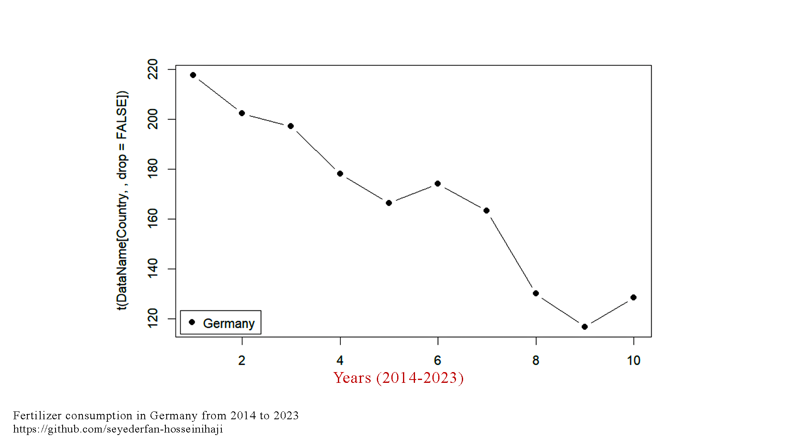
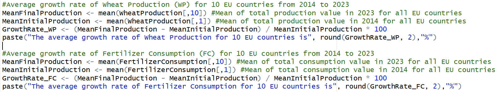
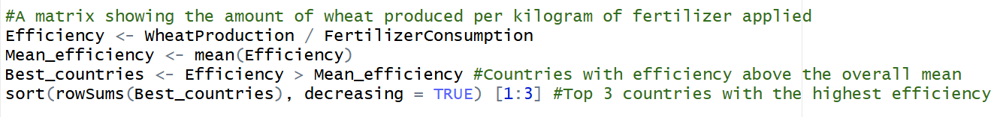

# Fertilizer Use and Wheat Production Correlation in EU - R lang

Here, I aimed to plot and analyze public agricultural data — such as Fertilizer Consumption (from [World Bank Open Data](https://data.worldbank.org/indicator/AG.CON.FERT.ZS)) and Wheat Production (from [FAO](https://www.fao.org/faostat/en/#data/QCL)) — to better understand fertilizer use trends and their impact on crop production in 10 European countries

First of all, it’s better to get familiar with the file structure in this project:

-   **OfficialDataFiles** -\> Original CSV files downloaded directly from official sources([FAO](https://www.fao.org/faostat/en/#data/QCL) and [WBOD](https://data.worldbank.org/indicator/AG.CON.FERT.ZS)); they may look messy or unorganized.

-   **FilteredDataFiles** -\> Cleaned and organized versions of the **OfficialDataFiles**; I specifically prepared them for this project.

-   **Fertilizer-CropYield.R** -\> Main Code File

### Outputs:

At the end of the Main Code File (Fertilizer-CropYield.R), you will find an **OUTPUTS** section that provides the following results:

-   By using the `ShowMe()` function, you can generate a **line graph** of your desired data. For example, to plot the Fertilizer Consumption (FC) for all 10 European countries, simply run the following line of code:\
    `ShowMe(FertilizerConsumption)`

    {width="430"}

    As another example, to view the Wheat Production (WP) graph for a specific country, such as Germany, use:\
    `ShowMe(WheatProduction, "Germany")` or `ShowMe(WheatProduction, 2)`

    {width="430"}

    As the final example, to see the Wheat Production (WP) line graph for 10 European countries, run:

    `ShowMe(WheatProduction)`

    {width="430"}

-   The code also calculates the **Pearson Correlation Coefficient (PCC)**, which represents the degree of correlation between Fertilizer Consumption and Wheat Production. Based on the result value of **0.7**, we can reasonably conclude that there is a positive correlation between these datasets. However, it is important to be aware that without considering other environmental factors, such as soil, climate, farming techniques, etc., the data cannot be fully analyzed.

-   I determined the **AGR (Average Growth Rate)** for **Wheat Production (WP)** and **Fertilizer Consumption (FC)** from 2014 to 2023 for 10 EU countries as a whole. Even though the AGR for WP slightly decreased by -3.18% over 10 years, considering the -23.43% AGR of FC, I believe this can be regarded as a significant achievement. As you may know, excessive fertilizer use can have several negative effects. For example, surface runoff can carry excess nutrients into rivers and lakes, causing **eutrophication**. In addition, overuse of fertilizers can alter soil pH and reduce organic matter.

    As a result, this was probably a good strategy implemented by EU countries, aiming to reduce fertilizer consumption to promote a more sustainable environment.

{width="679"}

-   You can see that I ranked the top three countries based on the number of years in which their production exceeded the mean from 2014 to 2023.
    Germany takes first place with a score of 10, meaning its efficiency was above the overall mean in every year of the 10-year period (2014–2023).

    

{width="1331" height="157"}
