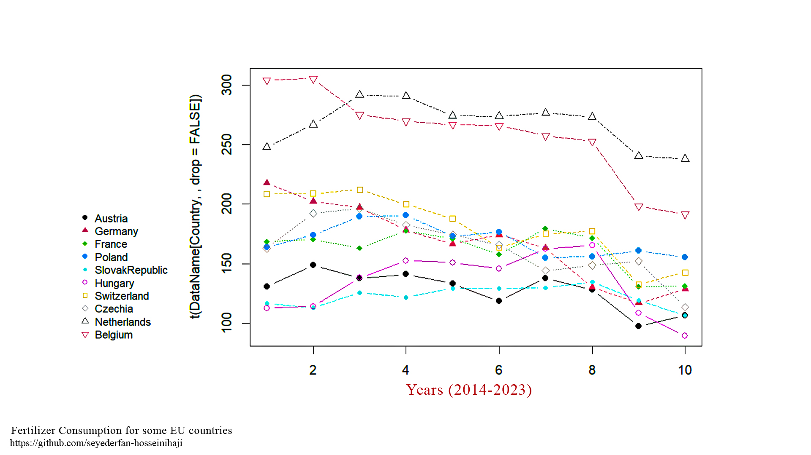

# Fertilizer Use and Wheat Production Correlation in Agriculture - R lang

Here, I aimed to plot and analyze public agricultural data — such as Fertilizer Consumption (from [World Bank Open Data](https://data.worldbank.org/indicator/AG.CON.FERT.ZS)) and Wheat Production (from [FAO](https://www.fao.org/faostat/en/#data/QCL)) — to better understand fertilizer use trends and their impact on crop production in Europe.

First of all, it’s better to get familiar with the file structure in this project:

-   **OfficialDataFiles** -\> Original CSV files downloaded directly from official sources([FAO](https://www.fao.org/faostat/en/#data/QCL) and [WBOD](https://data.worldbank.org/indicator/AG.CON.FERT.ZS)); they may look messy or unorganized.

-   **FilteredDataFiles** -\> Cleaned and organized versions of the OfficialDataFiles; I specifically prepared them for this project.

-   **Fertilizer-CropYield.R** -\> Main R script

### Outputs:

At the end of the main code file (Fertilizer-CropYield.R), you will find an **OUTPUTS** section that provides the following results:

-   Using the `ShowMe()` function, you can generate a line graph of your desired data. For example, to plot the Fertilizer Consumption (FC) for all 10 European countries, simply run the following line of code:\
    `ShowMe(FertilizerConsumption)`

    To view the Wheat Production (WP) graph for Germany, use:\
    `ShowMe(WheatProduction, "Germany")` or `ShowMe(WheatProduction, 2)`

